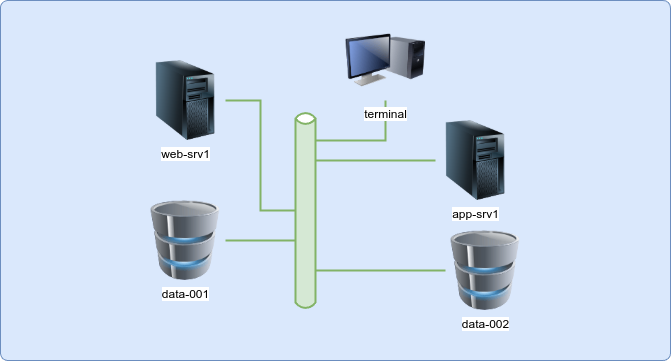

<!-- 
You can access these instructions any time via "Exam Information".

> **Remote Desktop**
> 
> Since 2022 the Exam UI is using a Remote Desktop (XFCE) instead of a Remote Terminal and the Linux Foundation released an update about this. Coming from OSX/Windows there will be changes in copy&paste for example. This simulator provides a very similar Remote Desktop environment.
> 
> There are still differences between the real exams and the simulators, like:
> 
> - You'll need to use the PSI Secure Browser to access the real exams whereas you can use Chrome/Firefox to access the simulators
> - In the simulators you can use the top navigation to switch back to the old Remote Terminal in case of issues, this isn't possible in the real exams 

## Countdown / Timer

The 120 minutes countdown will start once the session is started. It will be shown on top left. The countdown is just an indicator for yourself and won't revoke access to your environment when finished.

-->

## Servers

- You have access to 5 servers:

  - terminal (default)
  - web-srv1
  - app-srv1
  - data-001
  - data-002

- The server on which to solve a question is mentioned in the question text. If no server is mentioned you'll need to create your solution on the default terminal
- If you're asked to create solution files at /opt/course/*, then always do this on your main terminal
- You can connect to each server using ssh, like ssh web-srv1
- All server addresses are configured in /etc/hosts on each server
- Nested ssh is not possible: you can only connect to each server from your main terminal
- It's not possible to restart single servers. If deeper issues or misconfigurations occurred then the only solution might be to restart the complete simulator. This is possible using top menu by selecting "Restart Session" 

<!--
## VSCodium

You can use VSCodium to edit files and you can also use its terminal to run commands.
You're not allowed to install any VSCodium extensions.

## Solutions & Score

When the countdown reaches 0 you'll be able to see the proposed solutions for each task and your score. You can also access these earlier by selecting "Exam Controls -> Answers & Score". But it's recommended to try solving by yourself at first.

## 36hrs Access

You'll have access to your simulator environment during the next 36hrs. You'll always have access to the questions and solutions.

## Browser reload or close

For the 36hrs your session will be kept running in the background. You can close the window or even use a different browser without losing changes.
## Flag Questions

You can flag questions to return to later. This is just a marker for yourself and will not affect scoring.

## Rules

You're not allowed to use any external resources. Feel free to use the man pages for help.

## Difficulty

This simulator is more difficult than the real certification. We think this gives you a greater learning effect and also confidence to score in the real exam. Most of the simulator scenarios require good amount of work and can be considered "hard". In the real exam you will also face these "hard" scenarios, just less often. There are probably also fewer questions in the real exam.

## Content

All LFCS simulator sessions will have identical content/scenarios.

## Slow or interrupted connection?

If you experience any kind of issues please make sure all points here are complied with:

- Browser: only latest Chrome and latest Firefox are supported
- Ubuntu+Chrome: users report keyboard issues, switch to Firefox or Chromium
- Extensions: disable ALL extensions/plugins and run in private mode
- VPN/Proxy: don't use a VPN/Proxy
- Internet: use a stable internet connection, with low usage by others 

## Help / Support

- [FAQ](https://killer.sh/faq#session-runtime) for answers
- [Slack](https://killer.sh/slack) for scenario discussions
- [Support](https://killer.sh/support) for session/account issues 

-->