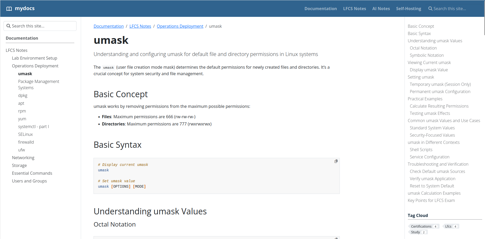

{}

Una colección personal de guías técnicas prácticas y notas de estudio, basada en el principio de que la mejor manera de aprender es enseñar.
{.mt-5}

{}

{}

  

    <h2 class="text-center text-md-start">Lo que encontrarás aquí</h2>
    
Este sitio se centra en contenido claro y procesable para profesionales de TI y entusiastas. Espere encontrar:

    <ul>
      <li><strong>Tutoriales paso a paso:</strong> tutoriales detallados para configurar y administrar sistemas, como la guía del <a href="/docs/lfcs/lab-setup/kvm-provision-centos/">aprovisionamiento de la VM CentOS con KVM</a>, que utilizo para el estudio de la certificación LFCS.</li>
      <li><strong>Referencias de comandos:</strong> desgloses integrales y/o resumidos de herramientas esenciales, como la inmersión del <a href="/docs/lfcs/operations-deployment/umask/">comando umask</a>.</li>
      <li><strong>Notas de estudio de la certificación LFCS:</strong> materiales curados dirigidos a certificaciones específicas, con un enfoque actual en la Sysadmin certificada de la Fundación Linux (LFCS).</li>
      <li><strong>iFragmentos prácticos:</strong> configuraciones listas para usar y ejemplos de línea de comandos para resolver problemas comunes.</li>
    </ul>
  

  

    
    <small class="d-block text-center mt-2">Ejemplo de una de la guía técnica en este sitio.</small>
  

{}

